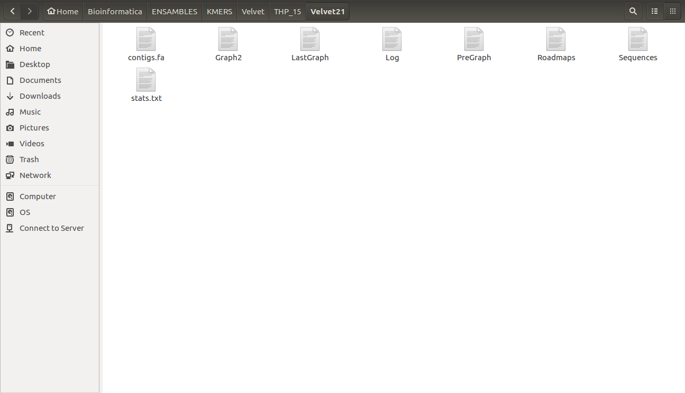

#Bioinformatica Avanzada
######Castillo Franco Yared Jafet
##Calidad de los Adaptadores
###FastQC
Comando:
- fastqc THP_15M_1.fastq

Ejemplo:

Archivos Creados:

Para visualizar Resultados:
- firefox THP_15M_1_fastqc.html

Ejemplo:

###Trim Galore
Comando:
- trim_galore - -fastqc - -paired - -retain_unpaired ../THP_15M_1.fastq ../THP_15M_2.fastq

Ejemplo:

Archivos Creados:

Visualización de Resultados:

Modificando la opción - -length_1 y - -length_2 a 40
Comando:
- trim_galore - -fastqc - -paired - -retain_unpaired - -length_1 40 - -length_2 40 ../THP_15M_1.fastq ../THP_15M_2.fastq - -output_dir ../Trim_Galore/THP15M_paired_50

Ejemplo:

Visualización de Resultados:

###Trimmomatic
Comando:
- java -jar /home/yared/Trimmomatic-0.36/trimmomatic-0.36.jar PE -phred33 ../THP_15M_1.fastq ../THP_15M_2.fastq THP_15M_1_paired.fastq THP_15M_1_unpaired.fastq THP_15M_2_paired.fastq THP_15M_2_unpaired.fastq ILLUMINACLIP:TruSeq3-PE.fa:2:30:10 LEADING:3 TRAILING:3 SLIDINGWINDOW:4:15 MINLEN:36

Ejemplo:

Archivos Creados:

Visualización de Resultados:

###DynamicTrim
Comando:
- /home/yared/SolexaQA++_v3.1.7.1/Linux_x64/SolexaQA++ dynamictrim ../THP_15M_1.fastq

Ejemplo:

Archivos Creados:

Visualización de Resultados:

##Ensambles
###Interleave
Comando:
- python2 /home/yared/interleave_fastq.py ../THP_15M_1.fastq ../THP_15M_2.fastq Inter_THP_15M.fastq

Ejemplo:

Archivos Creados:

###Fastq to Fasta
Comando:
- fastq_to_fasta -n -v -i ../Interleave/Inter_THP_15M.fastq -o Inter_THP_15M.fasta

Ejemplo:

Archivos Creados:

##A) Single vs Paired
Nota: Realizar con los archivos de todos los recortadores (TrimGalore, Trimmomatic, DynamicTrim)

###Velvet con Kmer de 21
####Lectura sencilla
Comandos:
- velveth Velvet21_SE 21 -fastq -short ../THP_15M_1.fastq
- velvetg Velvet21_SE/ -cov_cutoff auto -exp_cov auto

Ejemplo:

####Lectura pareada
Comandos:
- velveth Velvet21_PE 21 -fastq -separate -shortPaired ../THP_15M_1.fastq ../THP_15M_2.fastq
- velvetg Velvet21_PE/ -cov_cutoff auto -exp_cov auto

Ejemplo:

####Ambos archivos como lectura sencilla
Comandos:
- velveth Velvet21_SE2 21 -fastq  -short ../THP_15M_1.fastq -short2 ../THP_15M_2.fastq
- velvetg Velvet21_SE2/ -cov_cutoff auto -exp_cov auto

Ejemplo:

Archivos creados:

Contigs:

Vemos que trabajar con lecturas pareadas es mejor

###Spades
####Lectura sencilla
Comando:
- python2 /home/yared/SPAdes-3.11.0-Linux/bin/spades.py --careful -s ../THP_15M_1.fastq -k 21,31,41,51,61 -o spades_SE

Ejemplo:

####Ambos archivos como lectura sencilla
Comando:
- python2 /home/yared/SPAdes-3.11.0-Linux/bin/spades.py --careful -s ../THP_15M_1.fastq -s ../THP_15M_2.fastq -k 21,31,41,51,61 -o spades_SE2

Ejemplo:

####Lectura Pareada
Comando:
- python2 /home/yared/SPAdes-3.11.0-Linux/bin/spades.py --careful -1 ../THP_15M_1.fastq -2 ../THP_15M_2.fastq -k 21,31,41,51,61 -o spades_PE

Ejemplo:

Contigs:

Vemos que trabajar con lecturas pareadas es mejor

###IDBA_UD
Comando:
- /home/yared/idba-master/bin/idba_ud -r ../Inter_THP_15M.fastq - -mink 21 - -maxk 61 -o THP_15M_PE

Ejemplo:

Archivos creados:

Contigs:

Vemos que trabajar con lecturas pareadas es mejor

##Comparando con Quast
Comandos:
Clave: _15=original, tg=TrimGalore, tm=Trimmomatic, dy=DynamicTrim
- python2 /home/yared/quast-4.5/quast.py contigs_15.fa contigs_15_tg.fa contigs_15_tm.fa contigs_15_dy.fa
- python2 /home/yared/quast-4.5/quast.py contigs_15.fasta contigs_15_tg.fasta contigs_15_tm.fasta contigs_15_dy.fasta
- python2 /home/yared/quast-4.5/quast.py contigs_15.fasta contigs_15_tg.fasta contigs_15_tm.fasta contigs_15_dy.fasta

Ejemplo:

Resultados:

###Velvet

###Spades

###IDBA_UD

##B) Distintos valores de Kmer con Velvet
Nota: Realizar con los archivos de todos los recortadores (TrimGalore, Trimmomatic, DynamicTrim)

Comandos:
- velveth Velvet21 21 -fastq -separate -shortPaired THP_15M_1.fastq THP_15M_2.fastq
- velvetg Velvet21/ -cov_cutoff auto -exp_cov auto -ins_length 250
- velveth Velvet31 31 -fastq -separate -shortPaired THP_15M_1.fastq THP_15M_2.fastq
- velvetg Velvet31/ -cov_cutoff auto -exp_cov auto -ins_length 250
- velveth Velvet41 41 -fastq -separate -shortPaired THP_15M_1.fastq THP_15M_2.fastq
- velvetg Velvet41/ -cov_cutoff auto -exp_cov auto -ins_length 250
- velveth Velvet51 51 -fastq -separate -shortPaired THP_15M_1.fastq THP_15M_2.fastq
- velvetg Velvet51/ -cov_cutoff auto -exp_cov auto -ins_length 250
- velveth Velvet61 61 -fastq -separate -shortPaired THP_15M_1.fastq THP_15M_2.fastq
- velvetg Velvet61/ -cov_cutoff auto -exp_cov auto -ins_length 250

Ejemplo:

Archivos creados:

###Utilizando VelvetOptimiser para encontrar el mejor Kmero
Comando:
- perl /home/yared/VelvetOptimiser-master/VelvetOptimiser.pl --s 21 --e 61 --x 10 -f '-fastq -separate -shortPaired HP_91M_2.fastq HP_91M_2.fastq'

Ejemplo:

Archivos creados:

El mejor Kmero para el ensamble es 51

##Comparando con Quast
Comandos:
- python2 /home/yared/quast-4.5/quast.py contigs_15.fa contigs_15_tg.fa contigs_15_tm.fa contigs_15_dy.fa
- python2 /home/yared/quast-4.5/quast.py contigs_91.fa contigs_91_tg.fa contigs_91_tm.fa contigs_91_dy.fa

Ejemplo:

Archivos creados:

Resultados:
#####THP_15

#####HP_91

##C) Efecto de utilizar archivos con mayor cobertura
###Velvet
Comandos:
- velveth Velvet91_21 21 -fastq -separate -shortPaired THP_15M_1.fastq THP_15M_2.fastq
- velvetg Velvet91_21/ -cov_cutoff auto -exp_cov auto -ins_length 250
- velveth Velvet91_31 31 -fastq -separate -shortPaired THP_15M_1.fastq THP_15M_2.fastq
- velvetg Velvet91_31/ -cov_cutoff auto -exp_cov auto -ins_length 250

Ejemplo:

Archivos creados:

###Spades
Comandos:
- python2 /home/yared/SPAdes-3.11.0-Linux/bin/spades.py --careful -1 THP_15M_1.fastq -2 THP_15M_2.fastq -k 21,31,41,51,61 -o spades_THP_15M
- python2 /home/yared/SPAdes-3.11.0-Linux/bin/spades.py --careful -1 HP_91M_1.fastq -2 HP_91M_2.fastq -k 21,31,41,51,61 -o spades_HP_91M

Ejemplo:

Archivos creados:

###IDBA_UD
Comandos:
- /home/yared/idba-master/bin/idba_ud -r Inter_THP_15M.fasta  --mink 21 --maxk 61  -o THP_15M
- /home/yared/idba-master/bin/idba_ud -r Inter_HP_91M.fasta  --mink 21 --maxk 61  -o HP_91M

Ejemplo:

Archivos creados:

Contigs:
- Clave: v=velvet, s=spades, i=IDBA_UD

##Comparando con Quast
Comandos:
- python2 /home/yared/quast-4.5/quast.py contigs_15_21_v.fa contigs_15_31_v.fa contigs_15_s.fasta contig_15_i.fa

Ejemplo:

Archivos creados:

Resultados:

#####THP_15

#####HP_91

##D) Efecto del trimming
Nota: Realizar con los archivos de todos los recortadores (TrimGalore, Trimmomatic, DynamicTrim)

###Velvet
Comando:
- velveth Velvet15_21 21 -fastq -separate -shortPaired THP_15M_1_val_1.fq THP_15M_2_val_2.fq
- velvetg Velvet15_21/ -cov_cutoff auto -exp_cov auto -ins_length 250

Ejemplo:

Archivos creados:

###Spades
Comando:
- python2 /home/yared/SPAdes-3.11.0-Linux/bin/spades.py --careful -1 THP_15M_1_val_1.fq -2 THP_15M_2_val_2.fq -k 21,31,41,51,61 -o spades_HP_15M

Ejemplo:

Archivos creados:

###IDBA_UD
Comando:
- /home/yared/idba-master/bin/idba_ud -r Inter_THP_15M.t.fasta --mink 21 --maxk 61 -o HP_15M_trimm

Ejemplo:

Archivos creados:

####Contigs
#####Velvet

#####Spades

#####IDBA_UD

##Comparando con Quast
Comandos:
- python2 /home/yared/quast-4.5/quast.py contigs_15_tg.fa contigs_15_tm.fa contigs_15_dy.fa
- python2 /home/yared/quast-4.5/quast.py contigs_15_tg.fasta contigs_15_tm.fasta contigs_15_dy.fasta
- python2 /home/yared/quast-4.5/quast.py contigs_15_tg.fasta contigs_15_tm.fasta contigs_15_dy.fasta

Ejemplo:

Archivos creados:

Resultados:

#####Velvet

#####Spades

#####IDBA_UD

##Predicción y Anotación
### HERPES VIRUS 8
####Filtrar con TrimGalore
Comando:
- trim_galore --fastqc --paired --retain_unpaired HP8.1.fastq HP8.2.fastq

Ejemplo:

Archivos creados:

####Ensamble con Spades
Comando:
- python2 /home/yared/SPAdes-3.11.0-Linux/bin/spades.py --careful -1 HP8.1.fastq -2 HP8.2.fastq -k 21,31,41,51,61,71 -o spades_HP8
- python2 /home/yared/SPAdes-3.11.0-Linux/bin/spades.py --careful -1 HP8.1_val_1.fq -2 HP8.2_val_2.fq -k 21,31,41,51,61,71 -o spades_HP8val

Ejemplo:

Archivos creados:

###Comparando con Quast
Comando:
- python2 /home/yared/quast-4.5/quast.py contigs_8.fasta contigs_8_tg.fasta -o quast_HP8

Ejemplo:

Archivos creados:

Resultado:

###MUMMER
Comando:
- perl /home/yared/mummer-4.0.0beta1/nucmer ../HP8_reference.fa ../spades_HP8val/contigs.fasta

Ejemplo:

Archivo generado:

###MUMMERPLOT

Comando:
- perl /home/yared/mummer-4.0.0beta1/mummerplot -l out.delta

Archivos creados:

Resultado:

###Efecto de los Kmers
####Spades
Comando:
- python2 /home/yared/SPAdes-3.11.0-Linux/bin/spades.py --careful -1 HP8.1_val_1.fq -2 HP8.2_val_2.fq -k 33,55,77,99 -o spades_HP8val_v2

Ejemplo:

Archivos creados:

###Comparando con Quast
Comando:
- python2 /home/yared/quast-4.5/quast.py contigs_8.fasta contigs_8_tg.fasta contigs_8_tg_2.fasta -o quast_HP8_2

Ejemplo:

Archivos creados:

Resultado:

